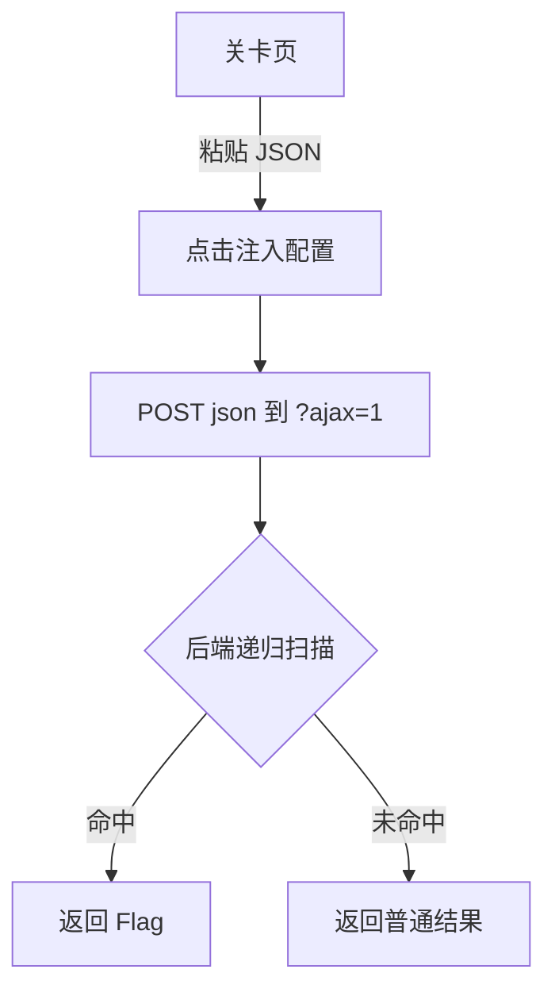

## 1. Product Overview
第十二关“极简原型投毒”提供最简单的 JSON 原型污染示例，一步式返回 Flag；无提示文案，帮助用户理解原型链污染基础原理。

## 2. Core Features

### 2.1 User Roles
| Role | Registration Method | Core Permissions |
|------|---------------------|------------------|
| Player | 无需注册 | 访问关卡、提交 JSON、查看 Flag |

### 2.2 Feature Module
本关仅包含一个核心页面：
1. **关卡页**：注入配置面板（textarea + 注入/重置按钮），结果区显示解析结果或 Flag。

### 2.3 Page Details
| Page Name | Module Name | Feature description |
|-----------|-------------|---------------------|
| 关卡页 | 注入配置面板 | 粘贴 JSON → 点击“注入配置” → 后端递归扫描，若任意层级存在 `__proto__` 且其 `polluted==="yes"` 则返回 `FLAG{PP_SIMPLE_POLLUTION}`。 |
| 关卡页 | 结果区 | 显示后端返回的解析结果或 Flag；无提示文案。 |

## 3. Core Process

## 4. User Interface Design
### 4.1 Design Style
- 与前面关卡完全一致：顶部标题、副标题、注入面板、结果区
- 主色 `#1e1e2f`，副色 `#f39c12`；按钮圆角；字体 14-16px
- 无额外提示图标或文案

### 4.2 Page Design Overview
| Page Name | Module Name | UI Elements |
|-----------|-------------|-------------|
| 关卡页 | 注入配置面板 | textarea（占位符示例 JSON），按钮组（注入配置/重置） |
| 关卡页 | 结果区 | 白底卡片，显示后端返回文本 |

### 4.3 Responsiveness
桌面优先，移动端自适应。