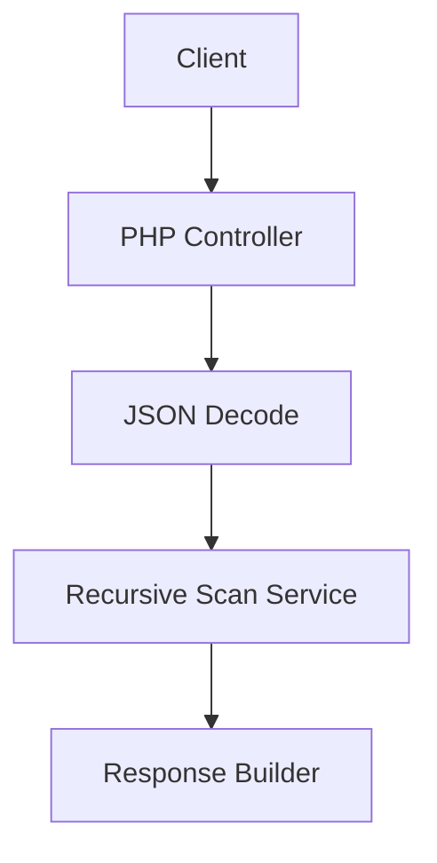

## 1. Architecture design
```mermaid
graph TD
  A[User Browser] --> B[React-like SPA (单页 PHP)]
  B --> C[PHP 后端 (?ajax=1)]
  C --> D[JSON 解析 & 递归扫描]
  D --> E{命中 __proto__.polluted==="yes"}
  E -->|是| F[返回 Flag]
  E -->|否| G[返回普通结果]
```

## 2. Technology Description
- Frontend: 单页 PHP + 原生 JS + TailwindCSS（沿用模板）
- Backend: PHP 8（内置 json_decode & 递归扫描函数）
- Initialization Tool: 无需额外构建，直接 PHP 内置服务器运行

## 3. Route definitions
| Route | Purpose |
|-------|---------|
| /directions/prototype/pp-prototype-poisoning/index.php | 关卡页，GET 展示界面，POST ?ajax=1 处理 JSON |

## 4. API definitions
### 4.1 注入检测接口
```
POST /directions/prototype/pp-prototype-poisoning/index.php?ajax=1
```
Request（form-data）：
| Param | Type | Required | Description |
|-------|------|----------|-------------|
| json | string | true | 原始 JSON 文本 |

Response（JSON）：
| Field | Type | Description |
|-------|------|-------------|
| flag | string | 命中时返回 FLAG{PP_SIMPLE_POLLUTION} |
| msg | string | 未命中时返回提示 |

Example：
```json
{"__proto__":{"polluted":"yes"}}
```

## 5. Server architecture diagram


## 6. Data model
无持久化数据库，仅内存解析 JSON。