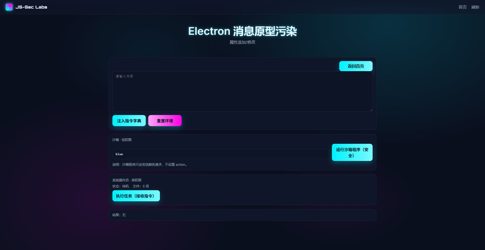

# JS-Sec Labs

一个可持续维护、风格炫酷的 JavaScript 安全靶场。所有关卡均为真实页面，不提供提示信息。当前按“方向”划分：
1) 原型链污染漏洞
2) JS 逆向




## 结构
- `index.html`：首页，动态渲染两个方向入口。
- `assets/`：公共样式与 UI 组件。
- `directions/directions.json`：方向列表配置。
- `directions/prototype/`：原型链污染方向入口与其关卡列表。
- `directions/reverse/`：JS逆向方向入口与其关卡列表。

## 新增关卡流程
1. 在对应方向目录下新增文件夹，如 `directions/prototype/<level-id>/`。
2. 创建 `index.html` 与入口脚本，引用 `../../assets/css/style.css` 和 `../../assets/js/ui.js`。
3. 在 `directions/<direction>/levels.json` 中追加条目，包含 `id`、`name`、`path`、`category`、`difficulty`。

## 本地预览
运行方式分两类，按需选择：

- 访问包含 `.php` 的关卡：使用 PHP 内置开发服务器（推荐）

  ```sh
  php -S 127.0.0.1:8000 -t .
  ```

  打开 `http://127.0.0.1:8000/`，首页与所有关卡（含 `.php`）均可正常访问。

- 仅预览纯前端页面（不含 `.php`）：可使用任意静态服务器（如 `http-server`、`serve`、或前端框架内置 dev server）。静态服务器无法执行 `.php`，这类关卡将不可用。

## 关卡与方向
- 方向入口由 `directions/directions.json` 驱动，首页脚本自动加载各方向的 `levels.json` 渲染卡片。
- 每个关卡在对应目录下提供真实入口页面（`index.html` 或 `index.php`）。
- 示例：原型链污染方向新增“YAML 解析原型污染”（`directions/prototype/pp-yaml-pollution/index.html`）。
